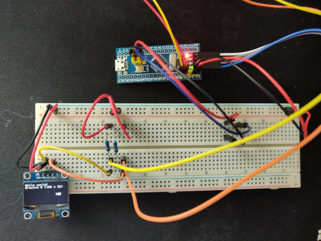

# STM32 I2C Example Project
STM32 I2C example project using a ssd1306 OLED display.

This has been developed to target the STM32F103C8T6 "Blue Pill" MCU, along with a cheap OLED black and white display commonly found on marketplaces ("GM009605v4" on the back).

No portion of this code has been automatically generated - it is completely barebones, with the exception of using the HAL library provided by ST.

## HAL Config
After running `make hal_config`, enable the following modules/drivers in the MCU config header file.

```
#define HAL_MODULE_ENABLED
#define HAL_CORTEX_MODULE_ENABLED
#define HAL_FLASH_MODULE_ENABLED
#define HAL_GPIO_MODULE_ENABLED
#define HAL_RCC_MODULE_ENABLED
#define HAL_I2C_MODULE_ENABLED
#define HAL_DMA_MODULE_ENABLED
```

## Circuit Schematic
Connect VDD to the 3.3V pin, GND to the ground pin, SCK (SCL) to PIN B8, and SDA to PIN B9.
You can change the I2C pins through `src/config.h`.

2 pull-up resistors are needed on the SCL and SDA lines. I used 10K resistors in conjunction with the 3.3V source pin.

(Note there are a few extra wires for the BOOT header pins here that are not required.)



## Prerequisites:
- [STM32Cube MCU Package](https://www.st.com/en/embedded-software/stm32cube-mcu-mpu-packages.html)
    - Requires a sign-in to ST in order to download.
- ARM embedded toolchain
    - On x86_64 Fedora, run `sudo dnf install arm-none-eabi-gcc arm-none-eabi-binutils arm-none-eabi-newlib` (installs a cross-compilation toolchain).
- STLink flashing tool
    - On x86_64 Fedora, run `sudo dnf install stlink`.
- GNU Make
    - On x86_64 Fedora, run `sudo dnf install make`.
- tr
    - On x86_64 Fedora, run `sudo dnf install coreutils` (most likely already installed).

## Blue Pill Quick Start
1. Download and extract the STM32Cube firmware package for your MCU, and update the `CUBE_PATH` variable to point to it.
2. Run `make hal_config`, making sure to change the configuration afterwards.
3. Run `make` to build the project.
4. Run `make flash` to flash the binary.

## SSD1306 Library
Uses the driver library found [here](https://github.com/afiskon/stm32-ssd1306), originally distributed under the MIT licence. Many thanks to the author(s)! Parts of it modified and/or removed as they are not needed.
```
MIT License

Copyright (c) 2018 Aleksander Alekseev

Permission is hereby granted, free of charge, to any person obtaining a copy
of this software and associated documentation files (the "Software"), to deal
in the Software without restriction, including without limitation the rights
to use, copy, modify, merge, publish, distribute, sublicense, and/or sell
copies of the Software, and to permit persons to whom the Software is
furnished to do so, subject to the following conditions:

The above copyright notice and this permission notice shall be included in all
copies or substantial portions of the Software.

THE SOFTWARE IS PROVIDED "AS IS", WITHOUT WARRANTY OF ANY KIND, EXPRESS OR
IMPLIED, INCLUDING BUT NOT LIMITED TO THE WARRANTIES OF MERCHANTABILITY,
FITNESS FOR A PARTICULAR PURPOSE AND NONINFRINGEMENT. IN NO EVENT SHALL THE
AUTHORS OR COPYRIGHT HOLDERS BE LIABLE FOR ANY CLAIM, DAMAGES OR OTHER
LIABILITY, WHETHER IN AN ACTION OF CONTRACT, TORT OR OTHERWISE, ARISING FROM,
OUT OF OR IN CONNECTION WITH THE SOFTWARE OR THE USE OR OTHER DEALINGS IN THE
SOFTWARE.
```

## Licence
GPLv3+  
See LICENCE.md for a full copy of the licence text.
